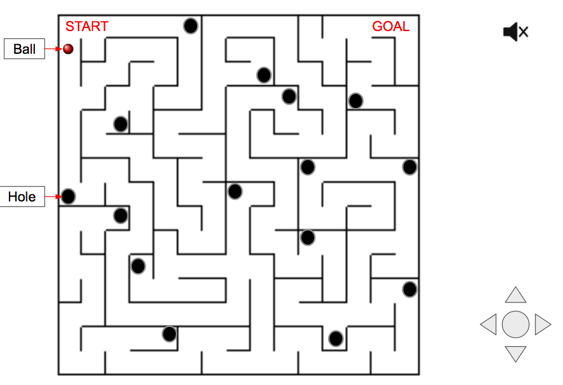

# Ball-in-Maze

### Background and Overview

Ball in maze is a game to manipulating the maze board to get the ball towards the goal.

In the javascript version, you can use either mouse or keyboard to play the game.

### Functionality & MVP

In Ball-in-Maze, users will be able to:

- [ ] Start, pause, restart
- [ ] Play with mouse or keyboard
- [ ] Restart the game if ball dropped
- [ ] Hear sounds on ball collisions and drop
- [ ] Play different level

In addition, this project will have:

- [ ] An modal describe the rules

### Wireframes

